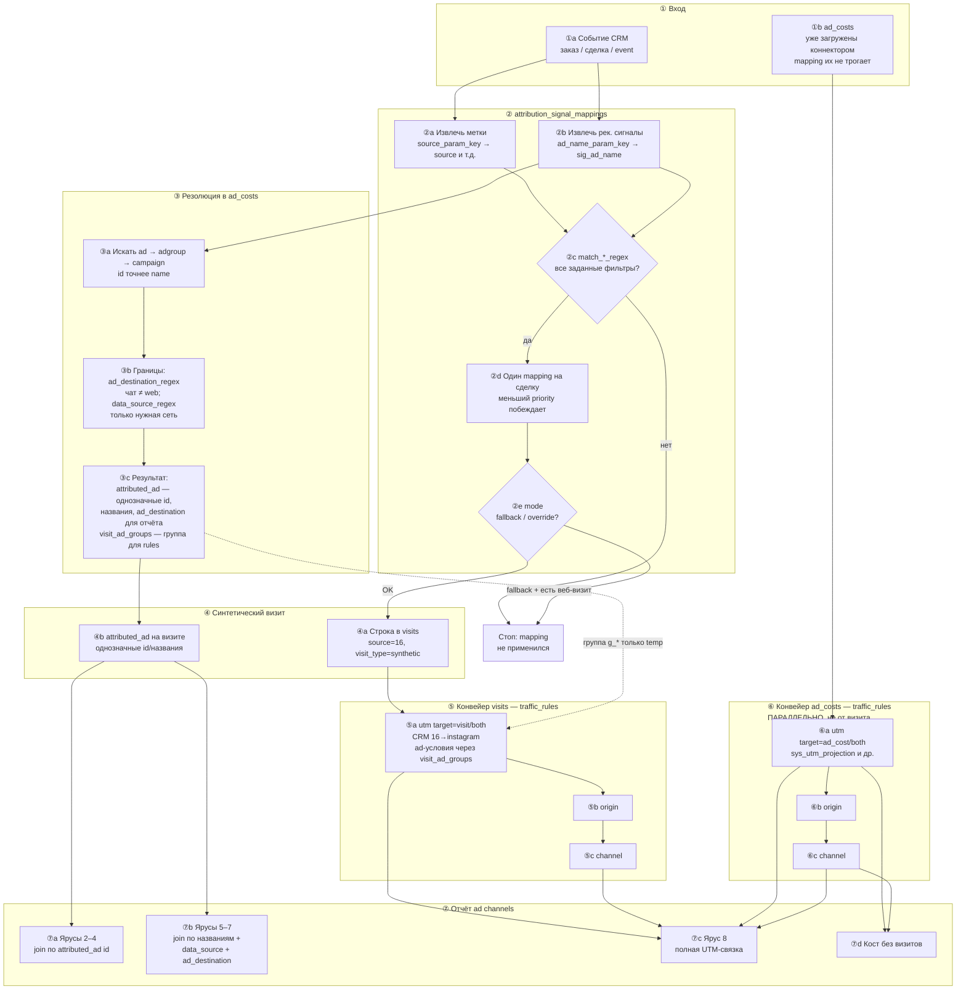

# Attribution signal mappings — практическая инструкция

> **Статус:** часть глобального ТЗ [`traffic-classification-and-synthetic-attribution.md`](./traffic-classification-and-synthetic-attribution.md), § **3.1.1**.  
> Нормативные поля и семантика — в §3.1 основного документа. Здесь — **как это исполняется в коде** (`update-costs-and-calculate-attribution.sql`) и как настраивать.  
> Эталон KeyCRM (sx_7905): [`tasks/keycrm-source-id-attribution/README.md`](../tasks/keycrm-source-id-attribution/README.md).

---

## Как читать этот документ

1. **Схема (шаги ①–⑦)** — ментальная модель пайплайна; под ней разбор каждого блока.
2. **Temp-таблицы и CTE** — текстовая привязка к SQL (`update-costs-and-calculate-attribution.sql`), без отдельной mermaid-схемы.

---

## Принципы (кратко)

1. **`attribution_signal_mappings`** — «откуда в CRM прочитать сигнал». **`traffic_rules`** — «что он значит» (метки, origin, channel).
2. **Метки** (`source_param_key`, …) → колонки визита. **Рекламная идентичность** (`ad_name_param_key`, …) → **поиск** в `ad_costs`, не прямое копирование в UTM.
3. **Mapping не пишет в `ad_costs`.** Только коннекторы наполняют расходы; синтетика ищет совпадения.
4. **Проекция UTM all-or-nothing:** если хотя бы одна из пяти меток визита уже заполнена (в т.ч. CRM-код `16`), автоподстановка campaign/content/term из расходов **не стартует**.
5. **Два независимых конвейера rules:** визиты и `ad_costs` классифицируются **отдельно**. Связь в отчёте — **`attributed_ad`** (id-ярусы 2–4, имён-ярусы 5–7) или полная UTM-связка (ярус 8), **не** utm rule «визит → его cost row».
6. **`visit_ad_groups` (temp, один прогон)** — группа найденных строк для **ad-условий** правил на визите. **`attributed_ad` (persist в `visits`)** — однозначные id, названия и `ad_destination` для **отчёта**; неоднозначное поле остаётся null, маркер `(combined)` в persist не попадает.

---

# Схема пайплайна (шаги ①–⑦)



### Разбор схемы (по шагам)

**① Вход**

- **①a** — событие из CRM/интеграции: в `custom_params` лежат `keycrm_source_id`, `keycrm_manager_comment` и т.д. Джоба читает **актуальное состояние** сделки (последнее событие по entity), якорь визита — момент **создания** сделки.
- **①b** — `ad_costs` уже есть от Meta/Google коннектора. Mapping **никогда** не INSERT/UPDATE сюда. Резолюция только **SELECT** по этой таблице.

**② Mapping**

- **②a** — по `source_param_key='keycrm_source_id'` читаем значение `16` → в визите будет `source='16'` (сырой CRM-код).
- **②b** — по `ad_name_param_key` читаем комментарий менеджера → `sig_ad_name='Промо март'` для поиска в расходах.
- **②c** — `match_source_regex='^16$'`: без совпадения mapping **выбывает** и даже не участвует в priority. Два mapping (^16$ и ^14$) на одном проекте **не конфликтуют** — у каждой сделки пройдёт максимум один.
- **②d** — если **два** mapping случайно прошли фильтры на **одну** сделку, остаётся один с **меньшим** `priority` (100 побеждает 200). Это не «отсечение до фильтров» — сначала фильтры, потом розыгрыш.
- **②e** — `override`: synthetic visit создаётся всегда. `fallback`: не создаём, если у профиля уже был **маркированный веб-визит** до якоря (ручной CRM-источник не крадёт last-click у точного веба).

**③ Резолюция**

- **③a** — ищем в `ad_costs`: сначала по `ad_id`, если нет — по `ad_name` (регистр **важен**), затем adgroup, campaign. Берётся **самый глубокий** уровень, где что-то нашлось.
- **③b** — границы резолюции: `ad_destination_regex='^chat$'` — одноимённое **web**-объявление в кандидаты **не попадёт**; `data_source_regex='(?i)^facebook_ads$'` — тёзка из **другой сети** группу не размывает.
- **③c** — два разных результата:
  - **`attributed_ad`** → persist на визите: **однозначные** id, **однозначные названия** (`campaign_name`/`adgroup_name`/`ad_name`) и **однозначный `ad_destination`**. Неоднозначное поле — null (маркер `(combined)` в persist не пишется). Тёзки по `ad_name` в разных кампаниях → id null, но `ad_name`+`data_source`+`ad_destination` заполнены — отчёт склеит через **имён-ярусы 5–7**.
  - **`visit_ad_groups`** → temp на прогон: агрегат `g_*` (`data_source`, `ad_destination`, …). Нужен, чтобы utm-правило на визите могло проверить «это facebook_ads + chat», хотя у визита **нет** колонки `data_source`.

**④ Синтетический визит**

- **④a** — INSERT в staging/persist: `visit_type='synthetic'`, метки из CRM, timestamp = якорь − 1 ms (last-click перед конверсией).
- **④b** — `attributed_ad` уже на визите; **`visit_ad_groups` в `visits` не пишется** — только temp.

**⑤ Конвейер visits**

- **⑤a utm** — правило `^16$` → `instagram`/`paid`, **`target=visit`**. Ad-условия (`data_source=facebook_ads`, `ad_destination=chat`) смотрят на **`visit_ad_groups`**, не на `attributed_ad`. Проекция **заблокирована** — `source` уже `16`.
- **⑤b–c origin/channel** — system seeds: `instagram`+`paid` → Meta Ads / Paid Social. Условия по **меткам** после utm; `target=both` здесь нормален.

**⑥ Конвейер ad_costs (параллельно)**

- **⑥a** — KeyCRM utm **не участвует** (`^16$` на costs не сработает — там нет `source=16`). Работают `sys_utm_projection_*` и свои rules; ad-условия — по **колонкам строки**.
- **⑥b–c** — те же seeds origin/channel, но **независимый** проход. Метки cost row и визита **могут отличаться** — это ок.

**⑦ Отчёт**

- **⑦a** — самый точный путь: визит и расход с **одним `attributed_ad` id** (ярусы 2–4: ad → adgroup → campaign).
- **⑦b** — id неоднозначны (тёзки), но название однозначно: имён-ярусы 5–7 (`ad_name` → `adgroup_name` → `campaign_name`). Замки — **строгое равенство** `data_source` и `ad_destination` (null с любой стороны = честный промах, каскад падает ниже). Кост-строки-тёзки схлопываются в **один бакет**; breakdown-колонки глубже зерна получают `(combined)` **при чтении** (reporting-service), в таблицы он не пишется.
- **⑦c** — полная пятёрка UTM + `strimix_refid`, побайтово (маркер `(combined)` в метках не живёт: кост-строка несёт свои настоящие значения, визит — однозначные значения группы или null).
- **⑦d** — расходы без парного визита.
- Принадлежность визита ярусу **не вычисляется отчётом**: джоба на шаге 10 материализует вердикт в `visits.ad_match_type` (`'strimix_refid'`, `'ad_id'`, …, `'utm_labels'`, null = uncosted), отчёт просто фильтрует по нему. Раньше каскад строился цепочкой `not exists` — план BigQuery рос экспоненциально от глубины каскада и падал с `resourcesExceeded`.

> **Главная ловушка:** стрелки от ⑤ к ⑥ **нет**. Utm rule визита **не перекрашивает** «его» строку расхода.

---

# Temp-таблицы и CTE (привязка к SQL)

Те же шаги ①–⑦, но с именами из джобы. Смысл блоков — в разделе «Разбор схемы» выше.

**Подготовка (до synthetic)**

| Таблица | Шаг джобы | Зачем |
| --- | --- | --- |
| `bot_ip` | 1 | Вырезать ботов |
| `profile_id_mapping` | 1.5 | Склеить профили |
| `identified_events` | 2 | Единый поток событий для page_views и synthetic |

**② `synthetic_signals` — CTE внутри `create temp table` (шаг 4.2.1)**

| CTE | Что делает | На что смотреть при отладке |
| --- | --- | --- |
| `mapped_events` | Каждое событие × каждый активный mapping; extract меток и sig_* | Правильный `entity`, `param_source`, ключи |
| `entity_signals` | Одна строка на `(mapping_id, entity, entity_id)`; метки из **последнего** события | CRM обновила сделку — метки сменятся на след. прогоне |
| `matched_signals` | Все `match_*_regex` должны совпасть (AND) | `^16$` vs `^14$` — разводят потоки |
| `present_signals` | Хотя бы одно не-null поле | Пустой mapping не создаёт визит |
| `deduped_signals` | `row_number() … order by priority asc` на `(entity, entity_id)` | Два прошедших фильтр mapping → один победитель |
| `allowed_signals` | `fallback` + проверка `visits_staging` на маркированный веб-визит | KeyCRM обычно `override` |
| `ad_level` / `adgroup_level` / `campaign_level` | JOIN `ad_costs` по id/name, скоуп `ad_destination_regex`, даты | См. шаг ③ на схеме |
| итог | `synthetic_signals` | `visit_id`, метки, `ad_group` (g_*), `attributed_ad` (u_*) |

**③ Резолюция (внутри `synthetic_signals`)**

Для каждого сигнала из `allowed_signals`: **ad_level** → если пусто, **adgroup_level** → если пусто, **campaign_level**. Из найденных строк: **`g_*`** в `ad_group` (для rules на визите), **`u_*`** в `attributed_ad` (только однозначные id).

**④ Temp после резолюции (шаги 4.2.2–4.2.3)**

| Таблица | SQL-шаг | Содержимое |
| --- | --- | --- |
| `visit_ad_groups` | 4.2.2 | `visit_id → ad_group as g`; живёт до конца прогона |
| `visits_staging` | 4.2.3 | web-визиты + INSERT synthetic |

**⑤ Классификация visits (4.3)**

| Temp | Стадия | Важно |
| --- | --- | --- |
| `visits_utm_rewritten` | utm | `target in ('visit','both')`; ad-условия → `left join visit_ad_groups`; проекция only if all 5 UTM null |
| `visits_with_origin` | origin | Видит **уже переписанные** utm-метки |
| `visits` | channel + fin | `create or replace` — атомарная запись |

**⑥ Классификация ad_costs (шаг 9)**

| Temp | Стадия | Важно |
| --- | --- | --- |
| `ad_costs_with_row_id` | — | `_row_id` для стабильного join между стадиями |
| `ad_costs_utm_rewritten` | utm | `target in ('ad_cost','both')`; ad-условия по **колонкам строки**; плейсхолдеры **построчно** из сетевых колонок самой строки (`(combined)` не материализуется) |
| `ad_costs_with_origin` | origin | |
| `ad_costs` | channel + fin | `create or replace` |

**Пост-обработка (шаги 10–11, после классификации обеих сторон)**

| Таблица/колонка | SQL-шаг | Зачем |
| --- | --- | --- |
| `visits.ad_match_type` | 10 | Материализованный вердикт «какой ярус склейки съел визит»: `strimix_refid` / `ad_id` / `adgroup_id` / `campaign_id` / `ad_name` / `adgroup_name` / `campaign_name` / `utm_labels` / null (uncosted). Считается через temp `visit_ad_match_assignment`, зеркалит ярусные join-ы отчёта (click_delay=false, дата в дату). Потребитель — только отчёт по рекламе |
| `traffic_label_combinations` | 11 | Словарь для селекторов фильтров: уникальные комбинации `date` + 5 UTM + `strimix_refid` + `traffic_origin` + `traffic_channel` из **обеих** таблиц (`visits` ∪ `ad_costs`). Расходы без кликов тоже попадают в фильтры |

**⑦ Отчёт** — см. §8 основного ТЗ; KeyCRM chat: `attributed_ad` id (ярусы 2–4), при тёзках — названия (ярусы 5–7). Ярус визита отчёт берёт готовым из `visits.ad_match_type` (шаг 10), а не вычисляет сам.

### `g_*` vs `u_*` — когда что получается

| Ситуация | `visit_ad_groups` (g_*) | `attributed_ad` (persist) |
| --- | --- | --- |
| Одно объявление в chat | `data_source=facebook_ads`, `ad_destination=chat`, … | все id и названия заполнены |
| Два ad_name-тёзка, одна сеть | id-поля в g могут быть `(combined)` | id null, но `ad_name`, `data_source`, `ad_destination` заполнены → имён-ярус |
| Тёзки в разных сетях | `(combined)` | `data_source` тоже null → имён-ярус промахнётся; лечится `data_source_regex` в mapping |
| CRM передала ad_id/имя, в costs пока пусто | — | id и имя клиента **сохраняются** до догрузки costs |

---

## Семантика `target` в `traffic_rules`

| `target` | Конвейер | Ad-условия |
| --- | --- | --- |
| **`visit`** | только ⑤ | через **`visit_ad_groups`**; на web-визите ad-условия **никогда** не матчятся |
| **`ad_cost`** | только ⑥ | колонки **самой** строки расхода |
| **`both`** | ⑤ и ⑥ **независимо** | не «связать визит с его cost row» — каждая сторона матчится сама |

| Тип правила | `target` | Почему |
| --- | --- | --- |
| CRM-код `^16$` → `instagram` | **`visit`** | на costs нет `source=16` |
| utm + ad-условия для synthetic | **`visit`** | ad-условия через `visit_ad_groups` |
| `sys_utm_projection_*` | **`ad_cost`** (+ зеркало visit) | плейсхолдеры `{campaign_name}` |
| origin Meta Ads по `instagram`+`paid` | **`both`** | после utm метки уже канонические на обеих сторонах |

---

## Словарь колонок mapping

| Колонка | Роль |
| --- | --- |
| `entity` / `param_source` | `order`/`deal` + `custom_params` или `event` + `event_params` |
| `source_param_key` … `term_param_key` | ключ CRM → колонка визита |
| `ad_id_param_key` … `ad_name_param_key` | ключ CRM → сигнал для JOIN `ad_costs` |
| `match_*_regex` | пост-фильтр после extract; `^16$` = полное совпадение |
| `ad_destination_regex` | граница резолюции: `^chat$`, `^web$`, … |
| `data_source_regex` | вторая граница резолюции: только строки нужной сети, `(?i)^facebook_ads$` |
| `mode` | `fallback` / `override` — см. ②e |
| `priority` | меньше = сильнее; только среди **прошедших фильтры** |

---

## Регулировка активации: CRM-значение + границы резолюции

Один CRM-поток разводится на разные сценарии **тремя рычагами**, которые работают на разных шагах:

1. **`match_*_regex`** (шаг ②c) — *какой mapping активируется*. Проверяется на извлечённом значении из CRM.
2. **`ad_destination_regex`** (шаг ③b) — *где искать рекламу*: только строки `ad_costs` с подходящим назначением (chat / web / …).
3. **`data_source_regex`** (шаг ③b) — *в какой сети искать*: только строки нужного коннектора (facebook_ads / google_ads / tiktok_ads).

Пример: клиент передаёт `keycrm_source_id` и название объявления в `keycrm_manager_comment`. Код `16` — Instagram-переписки (реклама с назначением chat в Meta), код `14` — заявки с сайта.

| Колонка | Mapping «чат» | Mapping «сайт» |
| --- | --- | --- |
| `source_param_key` | `keycrm_source_id` | `keycrm_source_id` |
| `ad_name_param_key` | `keycrm_manager_comment` | `keycrm_manager_comment` |
| `match_source_regex` | `^16$` | `^14$` |
| `ad_destination_regex` | `^chat$` | `^web$` |
| `data_source_regex` | `(?i)^facebook_ads$` | null (все сети) |
| `mode` | `override` | `fallback` |

Как это работает:

- Сделка с `source_id=16` **активирует только** mapping «чат» (`^16$` прошёл, `^14$` — нет): mappings не конфликтуют, розыгрыш `priority` не нужен.
- Резолюция названия «Промо март» идёт **только** среди chat-строк facebook_ads: одноимённое сайтовое объявление или тёзка из TikTok в группу не попадают. Поэтому `ad_destination` и `data_source` в `attributed_ad` получаются **однозначными** — а это обязательные замки имён-ярусов 5–7 в отчёте.
- Без `data_source_regex` кросс-сетевая тёзка сделала бы `data_source` неоднозначным (null в `attributed_ad`) — имён-ярус честно промахнулся бы, и связка упала бы до полной UTM-связки (ярус 8).

Правило большого пальца: **чем уже границы резолюции, тем однозначнее `attributed_ad` и тем выше ярус склейки в отчёте.** Для сигналов с названиями (без явных id) задавайте обе границы всегда, когда сценарий это позволяет.

---

## Сценарии (привязка к шагам схемы)

### A — только offline-источник (`deal_source`)

- ②a да, ②b нет → ③ пропуск → ④a с `source='Нетворкінг'`, без `attributed_ad`.
- ⑤ без ad-условий → ⑦c (ярус 8) или uncosted.

### B — только `ad_id`

- ③a находит одну строку → ④b + `visit_ad_groups`.
- Все UTM null → **проекция** в ⑤a и ⑥a.
- ⑦a ярус 2.

### C — `deal_source` + `ad_id`

- ④a: `source='Таргет'` → проекция **заблокирована**.
- ③ + ⑦a ярусы 2–4 или ⑦c.

### D — KeyCRM `source_id=16` + `ad_name` (Meta chat)

Эталон: [`tasks/keycrm-source-id-attribution/`](../tasks/keycrm-source-id-attribution/).

```text
keycrm_source_id = 16
keycrm_manager_comment = Промо март
```

| Настройка | Значение |
| --- | --- |
| mapping | `match_source_regex=^16$`, `ad_destination_regex=^chat$`, `data_source_regex=(?i)^facebook_ads$`, `ad_name_param_key=keycrm_manager_comment` |
| utm rule | `source_regex=^16$`, ad-условия fb+chat, `set_source/medium=instagram/paid`, **`target=visit`** |
| origin/channel | system seeds → Meta Ads / Paid Social на **обеих** сторонах отдельно |

**Проход по схеме ①–⑦:**

1. ②: extract `source=16`, `sig_ad_name='Промо март'`, фильтр OK.
2. ③: JOIN chat-строк facebook_ads в `ad_costs` → `attributed_ad` (однозначные id/названия/`ad_destination`) + `visit_ad_groups {fb, chat}`.
3. ④: synthetic visit в `visits_staging`.
4. ⑤: utm `16→instagram/paid` (ad-условия через **группу**); проекция не стартует.
5. ⑥: KeyCRM utm **не** трогает costs; projection + seeds.
6. ⑦: одно объявление «Промо март» → **ярусы 2–4** по id. Тёзки в нескольких кампаниях → id null, склейка по **`ad_name` + `data_source` + `ad_destination`** (ярус 5): все кост-строки-тёзки схлопываются в один бакет, кампания/группа в ячейках — `(combined)` при чтении. UTM визита и cost row **не обязаны совпадать**.

---

## Сводная таблица настройки

| Задача | Mapping | traffic_rules | Temp ad-условий | Отчёт (ярусы) |
| --- | --- | --- | --- | --- |
| Offline | source only | origin + channel | — | 8 |
| Полный UTM из CRM | 6 ключей меток | utm + origin + channel | — | 8 |
| Только ad_id | ad_id key | projection + seeds | `visit_ad_groups` | 2 |
| KeyCRM chat | source + ad_name + границы | utm **`target=visit`** + seeds | **`visit_ad_groups`** | 2–4, тёзки → 5–7 |
| source + ad_id | метки + ad keys | translate; projection blocked | `visit_ad_groups` | 2–4 или 8 |

---

## Частые ошибки

| Симптом | Шаг схемы | Причина |
| --- | --- | --- |
| Визит есть, cost не матчится | ③ | нет резолюции: `ad_name` регистр, `ad_destination_regex` |
| Имён-ярус не склеил тёзок | ③/⑦ | `data_source` или `ad_destination` в `attributed_ad` null (кросс-сетевые/кросс-destination тёзки) — задайте `data_source_regex` и `ad_destination_regex` в mapping |
| `source` остаётся `16` | ⑤ | нет строки в **`visit_ad_groups`** → ad-условия utm не прошли |
| Ждали instagram на cost от KeyCRM utm | ⑥ | CRM utm только **`target=visit`**; costs — projection |
| `target=both` на `^16$` «не работает» на costs | ⑥ | на costs нет `source=16` |
| Два mapping конфликтуют | ②d | нет взаимоисключающих `match_*`; нужны ^16$ vs ^14$ |
| Origin визита ≠ origin cost | ⑤ vs ⑥ | origin по ad-полям только на cost; для симметрии — **`both`** + условия по **меткам** |

---

## Связанные разделы

- §3.1 — поля mapping
- §3.2 — `traffic_rules`, стадии
- §5–§8 — сигнал, проекция, резолюция, ярусы отчёта
- [`tasks/keycrm-source-id-attribution/README.md`](../tasks/keycrm-source-id-attribution/README.md)
