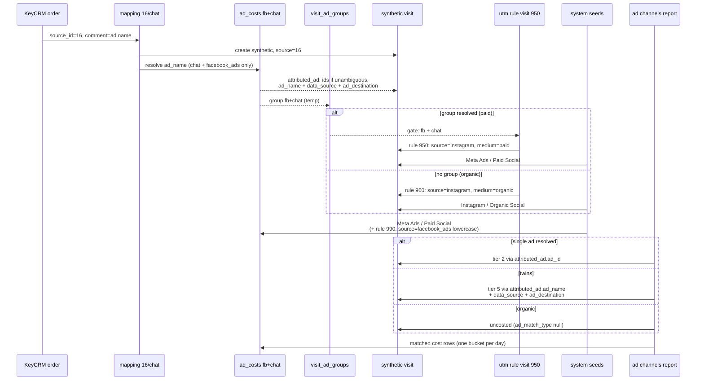

# KeyCRM: атрибуция по `keycrm_source_id` (sx_7905)

One-off конфигурация проекта **sx_7905**: синтетические визиты из KeyCRM-заказов, резолюция объявления Meta chat, склейка с расходами через **ярусы 2–4** (однозначные id) и **имён-ярусы 5–7** (тёзки), data schema **v2**.

Заменяет legacy:

- `tasks/attr_calc_job.txt` — блок 2.5 (synthetic Instagram page_view)
- `tasks/fb_ad_cost_job.txt` — chat UTM (новая unified job)

Глобальное ТЗ движка: [`docs/traffic-classification-and-synthetic-attribution.md`](../../docs/traffic-classification-and-synthetic-attribution.md)

**Схема пайплайна** (шаги ①–⑦ + temp-таблицы текстом):
[`docs/attribution-signal-mappings-instruction.md`](../../docs/attribution-signal-mappings-instruction.md)

---

## Файлы задачи

| Файл | Назначение |
|------|------------|
| [`migrate-sx7905.sql`](./migrate-sx7905.sql) | BigQuery: mapping + 4 traffic-правила (utm ×3, origin ×1). Идемпотентный: каждый прогон DELETE всех id файла → INSERT, правки structs подхватываются без ручной чистки. Project/dataset уже подставлены (`strimix-clients.sx_7905`) |
| [`README.md`](./README.md) | Этот документ |

---

## Проблема тёзок и выбранное решение (имён-ярусы `attributed_ad`)

**Реальность проекта:** таргетолог копирует креатив — одно `ad_name` живёт в нескольких группах и кампаниях. Резолюция по имени находит **несколько** строк `ad_costs` → однозначные id в `attributed_ad` **не записываются** → id-ярусы 2–4 отчёта не срабатывают.

**Решение — на уровне движка, конфиг остаётся простым.** `attributed_ad` теперь хранит не только id, но и **однозначные названия** (`campaign_name` / `adgroup_name` / `ad_name`) плюс **`ad_destination`**. Неоднозначное поле — null, маркер `(combined)` в persist не пишется. Отчёт (v2) склеивает визит с расходами каскадом:

| Ярусы | Ключ | Замки |
|-------|------|-------|
| **2–4** | id: `ad_id` → `adgroup_id` → `campaign_id` | `data_source` (мягкий: null или равно) |
| **5–7** | названия: `ad_name` → `adgroup_name` → `campaign_name` | `data_source` **и** `ad_destination`, строгое равенство: null с любой стороны = честный промах |
| **8** | полная UTM-связка | — |

**Для тёзок работает ярус 5:** все кост-строки «Промо март» (facebook_ads + chat, один день) схлопываются в **один бакет**, визит склеивается с ним один раз — конверсия + суммарные расходы всех тёзок в одной строке отчёта. Колонки глубже зерна (`ad_campaign_name`, `ad_adgroup_name`) честно показывают `(combined)` — маркер считается **при чтении** в reporting-service, в таблицы не пишется.

**Однозначное объявление:** `attributed_ad.ad_id` заполняется → визит съедается **ярусом 2** раньше имён. Точность сохраняется автоматически, конфиг менять не нужно.

**Почему границы резолюции обязательны:** замки ярусов 5–7 строгие. `ad_destination_regex='^chat$'` отсекает одноимённое сайтовое объявление, `data_source_regex='(?i)^facebook_ads$'` — кросс-сетевую тёзку. Без них поле в `attributed_ad` стало бы неоднозначным (null) и имён-ярус промахнулся бы.

---

## Каскад для этого конфига

| Ситуация | Ярус | Ключ склейки |
|----------|------|--------------|
| Имя нашло одно объявление | **2** | `attributed_ad.ad_id` + `data_source` |
| Тёзки в N кампаниях (fb + chat) | **5** | `attributed_ad.ad_name` + `data_source` + `ad_destination` + date |
| Имя не нашлось в costs | — | визит уходит в `instagram/organic` (фолбэк 960), `ad_name` из сигнала **сохраняется** в `attributed_ad`; после загрузки расходов следующий прогон пересоберёт визит: 950 переведёт в paid, ярус 5 склеит |

---

## Instagram Direct (`source_id = 16`)

### Mapping `custom_keycrm_16_instagram_chat`

| Поле | Значение |
|------|----------|
| `entity` | `order` |
| `source_param_key` | `keycrm_source_id` — сырой CRM-код в `source` |
| `ad_name_param_key` | `keycrm_manager_comment` |
| `match_source_regex` | `^16$` — роутер потоков |
| `match_ad_name_regex` | `.+` |
| `ad_destination_regex` | `^chat$` — граница резолюции |
| `data_source_regex` | `(?i)^facebook_ads$` — вторая граница |
| `mode` | `override` |

Проекция меток не нужна (склейка через `attributed_ad`), поэтому занятый `source='16'` ничему не мешает: all-or-nothing блокирует только правила-проекции, а их в этом конфиге нет.

### UTM-правила (пара 950 / 960, обе `target=visit`)

**`custom_keycrm_utm_16_instagram_chat` (priority 950) — платный поток**

| Поле | Значение |
|------|----------|
| `stage` / `target` | `utm` / **`visit`** — на строках расходов `source=16` не существует |
| `source_regex` | `^16$` |
| `data_source_regex` | `(?i)^facebook_ads$` — через `visit_ad_groups` |
| `ad_destination_regex` | `^chat$` — через группу |
| `set_source` / `set_medium` | `instagram` / `paid` |
| `applies_to_web` | `false` |

Ad-условия — гейт: `instagram/paid` получает только визит, чья резолюция подтвердила facebook_ads + chat.

**`custom_keycrm_utm_16_instagram_organic` (priority 960) — фолбэк-органика**

| Поле | Значение |
|------|----------|
| `source_regex` | `^16$`, ad-условий нет |
| `set_source` / `set_medium` | `instagram` / `organic` |

Ловит сигналы без зарезолвленной рекламы: коммент «профіль», ссылка на CRM-карточку и прочее — лид из Instagram Direct без рекламного следа. Правило совпадает со всеми синтетиками `source='16'`, но каждое поле выигрывает правило с меньшим priority, поэтому на зарезолвленных визитах побеждает 950, а сюда падает только органика. Сырой маркер `'16'` в данных больше не остаётся.

### Канонический source на строках расходов — lowercase

**`custom_utm_facebook_ads_source_lowercase` (priority 990, `target=ad_cost`)** — системная проекция `sys_utm_projection_ad_costs` (1000) пишет `set_source='{data_source}'` → `FACEBOOK_ADS` (как в колонке). Это правило выигрывает только поле `source` (990 < 1000) и пишет литерал `facebook_ads`; medium/campaign/content/term остаются у системной проекции.

### Origin / channel

- `sys_origin_meta_ads` (seed): `instagram` + `paid` → **Meta Ads** (визит); cost-строки fb+chat получают origin своим конвейером.
- `custom_origin_instagram_organic` (priority 1260): `instagram` + `organic` → **Instagram**. После `sys_origin_meta_ads` (1020), платный поток не задевает.
- `sys_channel_paid_social` (seed): Meta Ads → **Paid Social**.
- `sys_channel_organic_social_origin` (seed, 2060): origin Instagram → **Organic Social** — отдельное channel-правило не нужно.

---

## Ограничения и договорённости

1. **Регистр имени.** Резолюция сравнивает `ad_name` строго по регистру: «Промо Март» ≠ «промо март». Комментарий менеджера должен совпадать с названием в кабинете побайтово.
2. **Instagram Direct vs Lead Form** разводятся `ad_destination` (`^chat$` vs `^lead_form$`): у каждого потока свой mapping (`match_source_regex` по своему коду) и своё правило перевода со своим `source`.
3. **Метки визита и cost-строк не обязаны совпадать** — склейка идёт через `attributed_ad`, а не через UTM. Названия кампаний в отчёте — через сетевые параметры (`ad_campaign_name`, …), в бакете тёзок они честно `(combined)`.
4. **Дата:** резолюция и ярусы работают в рамках дня заказа (`click_delay=false`).
5. **Заказ без коммента** не проходит mapping (`match_ad_name_regex='.+'`) — синтетика не создаётся, заказ атрибутируется по last-click честно: реальному веб-визиту или синтетике более раннего заказа того же профиля. Это осознанно: снятие `.+` создавало бы override-синтетику каждому заказу source=16 и крало атрибуцию у реальных веб-визитов.
6. **В коммент пишется только название объявления** — договорённость с клиентом. Названия групп (`..._Group_1`) резолюцию не проходят и падают в органику; лечится номенклатурой комментов на стороне клиента, не конфигом.

---

## Пошаговый разбор

1. **Mapping** — заказ `source_id=16` → synthetic visit: `source='16'`, `sig_ad_name` из комментария менеджера.
2. **Резолюция** — по `ad_name` в границах `chat` + `facebook_ads`:
   - **`attributed_ad`** (persist) — однозначные id (тёзки → null), однозначные **названия** и `ad_destination='chat'`, `data_source='facebook_ads'`;
   - **`visit_ad_groups`** (temp) — группа для ad-условий правил.
3. **UTM на визите** — группа fb+chat есть → правило 950: `instagram/paid`; группы нет → фолбэк 960: `instagram/organic`.
4. **UTM на расходах** — KeyCRM-код не участвует; cost-строки живут своим конвейером (проекция 1000 + lowercase-правило 990: `source='facebook_ads'`).
5. **Origin / channel** — платный: Meta Ads / Paid Social (seeds); органика: Instagram (custom 1260) / Organic Social (seed 2060).
6. **Отчёт** — ярус 2 (однозначный ad_id) или ярус 5 (тёзки: бакет `date × ad_name × data_source × ad_destination`); органика — uncosted.



---

## Реестр source_id

| source_id | Канал | ad_destination | source |
|-----------|-------|----------------|--------|
| **16** | Instagram Direct (Meta chat) | `chat` | `instagram` |
| *TBD* | Facebook Lead Form | `lead_form` | `facebook` |

## Шаблон следующего канала

```text
mapping:  source_param_key=keycrm_source_id, match_source_regex=^XX$,
          ad_name_param_key=keycrm_manager_comment,
          ad_destination_regex=^<scope>$, data_source_regex=(?i)^<network>$
rule:     utm target=visit, source_regex=^XX$, ad-условия по скоупу,
          set_source/set_medium=<канал>
```

---

## Деплой

Prerequisites (порядок обязателен):

1. Задеплоена джоба с расширенным `attributed_ad` (первый прогон пересоздаёт `visits` с новым struct).
2. Проект переведён на data schema **v2** (включает ярусы `attributed_ad` в отчётах).

Затем:

1. Выполнить `migrate-sx7905.sql` в консоли BigQuery (project/dataset уже подставлены; cleanup удаляет все id файла и старые черновики, затем insert — правки применяются перезапуском скрипта).
2. Перезапустить attribution job.

Проверки после прогона:

```sql
-- 1. Synthetic-визиты: метки + attributed_ad
select date, source, medium,
       attributed_ad.ad_id, attributed_ad.ad_name,
       attributed_ad.data_source, attributed_ad.ad_destination
from `<project>.<dataset>.visits`
where visit_type = 'synthetic'
order by date desc limit 20;
-- ожидаем: платные instagram/paid, органика instagram/organic;
-- ad_id заполнен только у однозначных объявлений;
-- ad_name / data_source / ad_destination заполнены и у тёзок

-- 2. Сырой маркер '16' остаться не должен (фолбэк 960 переводит всё)
select count(*) from `<project>.<dataset>.visits`
where visit_type = 'synthetic' and source = '16';
-- ожидаем: 0

-- 2а. Органика: резолюция ничего не нашла, ad_name сохранён из сигнала
select date, source, medium, traffic_origin, traffic_channel, attributed_ad.ad_name
from `<project>.<dataset>.visits`
where visit_type = 'synthetic' and medium = 'organic'
order by date desc limit 20;
-- ожидаем: instagram/organic, Instagram / Organic Social;
-- после загрузки расходов следующий прогон пересоберёт и переведёт в paid

-- 3. Смоук имён-яруса: визит и расходы сходятся по имени + замкам
select v.date, v.attributed_ad.ad_name,
       count(distinct v.visit_id) as visits,
       count(distinct a.ad_id) as namesake_ads,
       sum(a.cost) as cost
from `<project>.<dataset>.visits` v
join `<project>.<dataset>.ad_costs` a
  on a.date = v.date
  and a.ad_name = v.attributed_ad.ad_name
  and a.data_source = v.attributed_ad.data_source
  and a.ad_destination = v.attributed_ad.ad_destination
where v.visit_type = 'synthetic'
  and v.attributed_ad.ad_id is null
  and v.attributed_ad.ad_name is not null
group by 1, 2
order by 1 desc;
```

---

## Частые проблемы

| Симптом | Причина | Что делать |
|---------|---------|------------|
| Визит с `source='16'` | Фолбэк 960 не применился (правило удалили / job старее миграции) | Перезапустить migrate + job |
| Лид в `instagram/organic`, хотя менеджер указал объявление | Резолюция не нашла `ad_name` в границах chat+fb: расходы ещё не загрузились / опечатка / регистр / в комменте название группы, а не объявления | Само починится после загрузки costs; проверить точное имя в кабинете |
| Имён-ярус не склеил | `data_source` или `ad_destination` в `attributed_ad` null | Проверить, что в mapping заданы обе границы (`ad_destination_regex`, `data_source_regex`) и прогнан свежий job |
| `(combined)` в колонках кампании/группы | Так задумано: бакет тёзок объединяет несколько кампаний | Ничего; это честная грануляция |
| Лидов в отчёте больше, чем в legacy-отчёте костыльной джобы | Костыльная джоба показывала только заказы с однозначным матчем имени; органика и тёзки были невидимы | Ничего; новая картина полнее |
| Заказ без коммента атрибутирован синтетике другого заказа | Last-click: своей синтетики нет, унаследовал последнюю маркированную точку профиля | Ничего; ожидаемое поведение |
| Старые правила `..._chat_visit` / `..._ad_cost` в таблице | Не прогнали cleanup | Перезапустить migrate |
